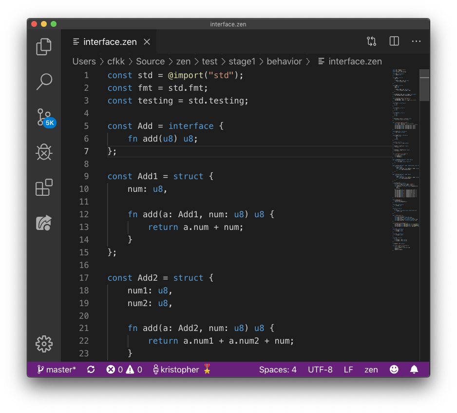

# vscode-zen

[Zen](https://zen-lang.org/) support for Visual Studio Code.

## Features

 - syntax highlighting
 - basic compiler linting
 - automatic formatting

## Automatic Formatting

To enable automatic formatting add the `zen` command to your `PATH`, or
modify the `Zen Path` setting to point to the `zen` binary.